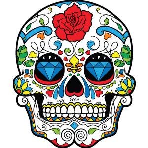

### ACTIVIDAD 5 - COLOR EN IMAGEN
### VILLASEÑOR CORNEJO RODRIGO SEBASTIAN

# IDENTIFICACIÓN DE COLOR ESPECIFICO EN IMAGEN

## Introducción

El problema que nos plantean en esta quinta actividad es un poco más complejo a lo que manejamos con anterioridad, ya que realizamos el programa para encontrar islas en una matriz dada, usando un método recursivo para descubrir en un solo conteo todas las celdas que pertenecen a la isla ya descubierta, ahora podemos utilizar las bases de la resolución de ese problema para usarlo de nuevo. La imagen que utilizaremos es un ejemplo para el problema y se ve en la parte de abajo.

La cuestión en esta ocasión es contar todos aquellos pixeles que formen islas con el color rojo en la imagen mostrada, aplicando los principios de recursividad y trabajo sobre una matriz.

## Desarrollo

Comencemos entonces con las deducciones que se pueden tomar al respecto con la información dada y a según lo que ya sabemos en el manejo de este tipo de problemáticas.

**Deducción 1:**
> La primera deducción que podemos hacer es definir el color a buscar en la imagen, el problema nos dice que el rojo, pero si analizamos la imagen podemos ver que hay varios tonos de rojo, así que vamos a ver en código RGB de los colores rojos. El color rojo puro en hexadecimal es:

RGB(255,0,0)

Rojo base.

> Aunque el color rojo puro es el anteriormente visto hay un rango de colores en rojo que llegan al café, pero aun siendo rojos estos empiezan a partir del:

RGB(100,0,0)

Rojo obscuro.

> Vemos que, aunque el color anteriormente mostrado se asemeja más a un café pues en cierto punto es rojo, así que ese sería el límite inferior dentro del rango de rojos, y nos queda delimitar el límite superior, lo que serían los rojos más claros, llegando al naranja, este límite se alcanza con el color:

RGB(255, 100, 100)

Rojo claro.

>Ya definidos los limites podemos continuar con el siguiente paso.

**Deducción 2:**
> La segunda cuestión es ver que modificaciones le vamos a hacer al programa que construimos en la actividad anterior, si lo revisamos vamos a trabajar con el método iterativo y recursivo. Lo más sencillo es por el método recursivo, ya que lo que se nos pide es contar los elementos de color rojo, así que podríamos tomar el mismo método recursivo utilizado en el programa anterior y hacer algunas modificaciones, para empezar, creo que sería buena opción imprimir los elementos que se encuentran, como hacer un filtro, en dado caso que se encuentre un elemento en el rango de los rojos pues se imprime y después dispara el método recursivo, que al final de cuentas haría lo mismo. aquí dejo explicado no en código final como tal, pero lo que se haría conceptualmente.

~~~
def RedPixel(i, j):
if(img2[i, j][2] >= BaseRedMin and img2[i, j][2] <= BaseRedMax):
if(img2[i, j][1] >= DarkRedMin and img2[i, j][1] <= DarkRedMax):
if(img2[i, j][0] >= LightRedMin and img2[i, j][0] <= LightRedMax):
return True;
return False;

def MetRecursivo(i, j):
if not(i < 0 or i >= w or j < 0 or j >= h):
if(RedPixel(i,j)):
img2[i,j][2] = 0
img2[i,j][1] = 0
img2[i,j][0] = 0
MetRecursivo(i - 1, j)
MetRecursivo(i + 1, j)
MetRecursivo(i, j - 1)
MetRecursivo(i, j + 1)
return

for i in range(w):
for j in range(h):
if(RedPixel(i, j)):
islands += 1
MetRecursivo(i, j);
~~~

>Podemos ver que es muy similar a la función que definimos en la actividad anterior, se añadirían algunas funciones como la de **RedPixel** que la usaría para validar si el valor de la casilla se encuentra entre el rango de rojos que definimos con anterioridad.

**Deducción 3:**
> La tercera deducción viene ya que al estar planteando las anteriores creo que es más viable hacer una copia de la imagen para trabajar con ella, para así poder modificar los datos, ya que al haber pasado por las casillas hay que cambiar el valor, esto para que no contemos o tomemos el valor varias veces y pueda contarnos más de una vez la función.

## Solución

La solución al problema dado se vera de nueva cuenta como en la actividad anterior dada mediante un código implementado en el archivo adjunto de nombre **'A5_Busqueda de color_VCRS.ipynb'**. Aunque no se explique demasiado sobre el documento, el código cuenta con la estructura y comentarios suficientes para respaldar el entendimiento en la resolución del conflicto.