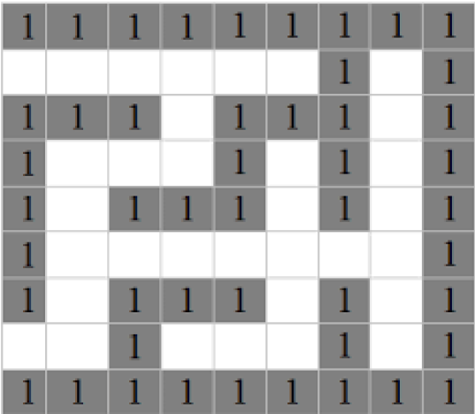

### ACTIVIDAD 7 - LABERINTO
### VILLASEÑOR CORNEJO RODRIGO SEBASTIAN

# RESOLUCIÓN DE UN LABERINTO CON HEURÍSTICA

## Introducción

### ¿Qué es la heurística?

La heurística es un enfoque de resolución de problemas o toma de decisiones que se basa en la intuición, el juicio y la experiencia práctica en lugar de seguir un método algorítmico o un procedimiento exhaustivo. Las heurísticas son estrategias prácticas o reglas generales que se utilizan para simplificar la toma de decisiones y encontrar soluciones aproximadas cuando la búsqueda de una solución óptima es computacionalmente costosa o impracticable.

Aquí hay algunas características clave de la heurística:

**Simplificación del Problema:**

Las heurísticas a menudo simplifican el problema, eliminando detalles innecesarios o reduciendo la complejidad para hacer que la solución sea más manejable.

**Intuición y Experiencia:**

Las heurísticas se basan en la experiencia previa y la intuición del individuo que las aplica. No siguen un proceso formal y pueden depender en gran medida del conocimiento acumulado a lo largo del tiempo.

**Rapidez y Eficiencia:**

Las heurísticas son seleccionadas para ser rápidas y eficientes. A menudo se utilizan cuando se necesita una solución en un tiempo limitado y la búsqueda exhaustiva no es práctica.

**Soluciones Aproximadas:**

Las soluciones proporcionadas por las heurísticas no garantizan ser óptimas. Sin embargo, pueden ser lo suficientemente buenas para abordar el problema de manera efectiva en muchas situaciones.

**Adaptabilidad:**

Las heurísticas pueden adaptarse a diferentes contextos y pueden aplicarse de manera flexible según las circunstancias. No son reglas rígidas, sino pautas generales.

Ejemplos comunes de heurísticas incluyen reglas prácticas, atajos mentales y enfoques intuitivos para la resolución de problemas. Por ejemplo, la regla de "prueba y error" es una forma de heurística donde se exploran diferentes soluciones hasta encontrar una que funcione. Otro ejemplo es la "regla del pulgar" que sugiere soluciones basadas en experiencias anteriores sin seguir un razonamiento lógico formal.

Es importante destacar que, si bien las heurísticas son valiosas en muchos contextos, también pueden llevar a soluciones subóptimas en algunos casos. Dependiendo del problema y de la precisión requerida, a veces se prefiere utilizar métodos más rigurosos y algorítmicos para garantizar la obtención de soluciones óptimas.

### Problema del laberinto

Los laberintos se clasifican básicamente en dos grandes grupos "según la
relación que existe con el centro y la salida de este". El primer grupo de
estos laberintos es el laberinto clásico o laberinto univiario: es el que hace
recorrer, al ingresar en él, todo el espacio para llegar al centro mediante
una única vía, camino o sendero; es decir, no ofrece la posibilidad de tomar
caminos alternativos, no hay bifurcaciones, sino que existe una sola puerta
de salida, que es la misma por la que se entra al laberinto. Por el hecho de
tener un solo camino o sendero que seguir a medida que se avanza dentro
de él, no es posible perderse en su interior. Por ser el laberinto más sencillo
es frecuentemente utilizado para realizar experimentos de robótica en
informática, especialmente populares en Japón.

Para esta actividad vamos a tener en cuenta la estructura del siguiente laberinto:

Y nuestro objetivo será hacer uso de la heurística para encontrar un patrón en la solución de laberintos y poder programarlo en código.

## Desarrollo

El método de la pared izquierda (o mano izquierda) es un algoritmo recursivo utilizado para resolver laberintos. Este algoritmo sigue una regla simple basada en la colocación de la mano izquierda en una pared del laberinto y sigue moviéndose en esa dirección hasta encontrar la salida. Aquí hay una descripción de cómo funciona el método recursivo de la pared izquierda para la resolución de laberintos cuadrados:

**Inicio:**

Comienza en un punto inicial del laberinto.

**Colocación de la Mano Izquierda:**

Imagina que colocas tu mano izquierda en la pared a tu izquierda y caminas hacia adelante.

**Reglas de Movimiento:**

Si hay un pasillo directamente a tu izquierda, gira a la izquierda y avanza.
Si no hay un pasillo a tu izquierda, sigue adelante.
Si no hay un pasillo adelante, gira a la derecha.

**Seguir la Pared:**

Continúa siguiendo la pared izquierda y ajustando tu dirección según las reglas anteriores.

**Recursividad:**

Si encuentras una bifurcación y no puedes seguir la pared izquierda, utiliza la recursividad para explorar las opciones disponibles.
Cuando recursivamente exploras una opción, marca la ubicación actual para evitar entrar en un bucle infinito.

**Salir del Laberinto:**

Continúa hasta que encuentres la salida del laberinto.

La idea central detrás del método de la pared izquierda es que, si sigues siempre la pared izquierda, eventualmente recorrerás todo el perímetro del laberinto y, por lo tanto, encontrarás la salida.

Es importante tener en cuenta que este método puede no funcionar correctamente en todos los tipos de laberintos. Si el laberinto tiene bucles cerrados o configuraciones específicas, el método puede conducir a un comportamiento incorrecto. Sin embargo, para laberintos bien diseñados, el método de la pared izquierda suele ser efectivo y fácil de implementar.

## Solución

Aplicando el método anterior de manera más simple y tomando en cuenta lo que ya vimos en la introducción, podemos pensar en que la resolución para un laberinto se daría gracias a la recursividad y haciendo un recorrido dado.

Este recorrido será definido por un movimiento donde primero se verifica la posición izquierda, luego la superior, la inferior y al final la derecha, además una vez que se pase por un camino, este quedará marcado y si no se encuentra una salida, se puede regresar por el camino anterior y realizando una segunda marca que índice la imposibilidad de repetir un error.

El siguiente código en Python explica de manera sencilla el recorrido:

~~~
# VERIFICACIÓN IZQUIERDA
if(imagen_bgr[y1,(x1-1)] == (Negro)):
print("SI1");
# VERIFICACIÓN SUPERIOR
if(imagen_bgr[(y1-1),x1] == (Negro)):
print("SI2");
# VERIFICACIÓN INFERIOR
if(imagen_bgr[y2,(x2-1)] == (Blanco)):
print("SI3");
# VERIFICACIÓN DERECHA
if(imagen_bgr[(y2-1),x2] == (Negro)):
print("SI4");
~~~

A su vez este mismo recorrido se hará con tres verificaciones, una para el comienzo del laberinto que solo se realiza una vez, luego, dentro de un ciclo se verificaran los caminos disponibles, se marcaran los ya recorridos y se comprobara si en algún momento se llegó a la salida. El funcionamiento completo del código, con imágenes y comentado paso por paso se puede ver en el archivo adjunto de nombre **'A7_Laberinto_VCRS.ipynb'**.
