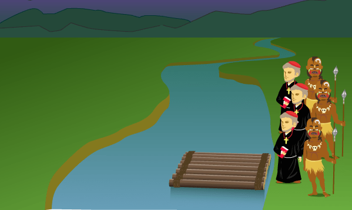

### ACTIVIDAD 8 - MISIONEROS
### VILLASEÑOR CORNEJO RODRIGO SEBASTIAN

# ESPACIO DE ESTADOS EN UN PROBLEMA DE MISIONEROS

## Introducción

Tres misioneros se perdieron explorando una jungla. Separados de sus
compañeros, sin alimento y sin radio, solo sabían que para llegar a su destino
debían ir siempre hacia adelante. Los tres misioneros se detuvieron
frente a un río que les bloqueaba el paso, preguntándose que podían hacer.
De repente, aparecieron tres caníbales llevando un bote, pues también ellos
querían cruzar el río. Ya anteriormente se habían encontrado grupos de
misioneros y caníbales, y cada uno respetaba a los otros, pero sin confiar
en ellos. Los caníbales se daban un festín con los misioneros cuando les
superaban en número.

Los tres caníbales deseaban ayudar a los misioneros a cruzar el río, pero
su bote no podía llevar más de dos personas a la vez y los misioneros no
querían que los caníbales les superaran en número.

¿Cómo puede resolverse el problema, sin que en ningún momento haya
más caníbales que misioneros en cualquier orilla del río? recuerda que un
misionero y un caníbal en una orilla del río más uno o dos caníbales en el
bote al mismo lado, significa que los misioneros tendrán problemas.

## Desarrollo

Este problema también nos pide encontrar los estados por los que pasa para llegar a la solución, nos plantea lo siguiente, tenemos 3 misioneros que se perdieron en una isla, se encontraron con 3 caníbales, después de esto quieren cruzar un rio, pero solo había una balsa en donde caben 2 personas, el problema es que no se pueden quedar de un lado más caníbales que misioneros ya que si eso pasa se los comieron, lo que nos pide es encontrar una forma de pasar a todos del otro lado del rio sin que en ningún momento se queden más caníbales de cualquier lado.

La representación de la situación es así:
>🧑‍🦳🧑‍🦳🧑‍🦳 👨🏿👨🏿👨🏿 | ⛵ | ____

De forma que podemos empezar a resolver o simular la posible solución, teniendo en cuenta las únicas 2 reglas

- Solo caben 2 personas en el bote y una tiene que manejarlo a fuerzas, así que uno tiene que regresarse manejándolo.
- En ningún momento se pueden quedar más caníbales que monjes de ningún lado.

## Solución

**Posición inicial:**
>🧑‍🦳🧑‍🦳🧑‍🦳 👨🏿👨🏿👨🏿 | ⛵ | ____

**Viaje 1:** En el primer viaje se iría un monje y un caníbal, del otro lado se queda el caníbal y se regresa manejando el bote el monje.
>🧑‍🦳🧑‍🦳 👨🏿👨🏿 | ⛵👨🏿🧑‍🦳 | ____
>|-----------|---------|-----|
>🧑‍🦳🧑‍🦳 👨🏿👨🏿 | ⛵🧑‍🦳 | 👨🏿 |
>🧑‍🦳🧑‍🦳🧑‍🦳 👨🏿👨🏿 | ⛵ | 👨🏿 |

**Viaje 2:** En este viaje se irían dos caníbales, del otro lado se queda uno de ellos y otro se regresa.
>🧑‍🦳🧑‍🦳🧑‍🦳 | ⛵👨🏿👨🏿 | 👨🏿 |
>|-----------|---------|-----|
>🧑‍🦳🧑‍🦳🧑‍🦳 | ⛵👨🏿 | 👨🏿👨🏿 |
>🧑‍🦳🧑‍🦳🧑‍🦳 👨🏿 | ⛵ | 👨🏿👨🏿 |

**Viaje 3:** En este viaje se irían dos mojes, del otro lado se queda 1 monje y se regresa en el bote un caníbal y un monje.
>🧑‍🦳👨🏿 | ⛵🧑‍🦳🧑‍🦳 | 👨🏿👨🏿 |
>|-----|------------|-------|
>🧑‍🦳👨🏿 | ⛵👨🏿🧑‍🦳 | 👨🏿🧑‍🦳 |
>🧑‍🦳👨🏿👨🏿🧑‍🦳 | ⛵ | 👨🏿🧑‍🦳 |

**Viaje 4:** En este viaje se irían dos mojes, del otro lado se quedan los monjes y se regresa en el bote un caníbal.
>👨🏿👨🏿 | ⛵🧑‍🦳🧑‍🦳 | 👨🏿🧑‍🦳 |
>|-----|------------|-------|
>👨🏿👨🏿 | ⛵👨🏿 | 🧑‍🦳🧑‍🦳🧑‍🦳 |
>👨🏿👨🏿👨🏿 | ⛵ | 🧑‍🦳🧑‍🦳🧑‍🦳 |

**Viaje 5:** En este viaje se irían dos caníbales, del otro lado se queda uno y se regresa en el bote un caníbal.
>👨🏿 | ⛵👨🏿👨🏿 | 🧑‍🦳🧑‍🦳🧑‍🦳 |
>|-----|------------|-------|
>👨🏿 | ⛵👨🏿 | 🧑‍🦳🧑‍🦳🧑‍🦳👨🏿 |
>👨🏿👨🏿 | ⛵ | 🧑‍🦳🧑‍🦳🧑‍🦳👨🏿 |

**Viaje 6:** En este viaje se irían dos mojes, así quedan todos del otro lado y se cumple lo pedido.
>👨🏿👨🏿 | ⛵ | 🧑‍🦳🧑‍🦳🧑‍🦳👨🏿 |
>|-----|------------|-------|
> ____ | ⛵👨🏿👨🏿 | 🧑‍🦳🧑‍🦳🧑‍🦳👨🏿 |
> ____ | ⛵ | 👨🏿👨🏿👨🏿🧑‍🦳🧑‍🦳🧑‍🦳 |