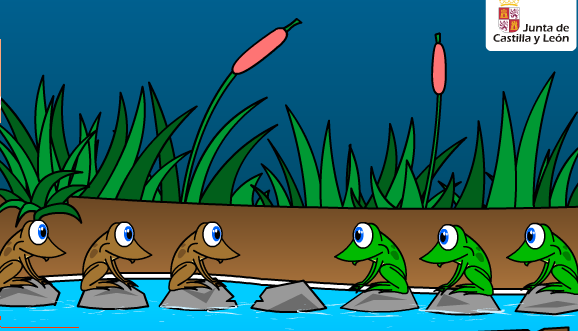

### ACTIVIDAD 8 - RANAS
### VILLASEÑOR CORNEJO RODRIGO SEBASTIAN

# ESPACIO DE ESTADOS EN UN PROBLEMA DE RANAS

## Introducción

El juego consiste en pasar las 3 ranas verdes a la derecha y las 3 ranas
marrones a la izquierda. Las ranas pueden saltar a una piedra vacía que
tengan delante, o saltar por encima de otra rana si en medio de ambas hay
una piedra vacía. Pulsa sobre la rana que quieres que salte.

## Desarrollo

Ahora en vez de programar el programa nos platea realizar el diagrama de estados para solucionar el problema de las ranas, este nos platea que tenemos 6 ranas, 3 de cada color. se supone que están acomodadas de manera que tenemos 7 posiciones, 3 en cada lado agrupadas por colores y una posición en medio que queda vacía para así poder mover las ranas. Simbolizado se vería algo así:

> 🐸 🐸 🐸 _ 🐻 🐻 🐻

Estos emojis son solo para simbolizar que son diferentes de cada lado, para simbolizar las ranas verdes si utilizare emojis de rana, y para simbolizar las ranas cafés utilizare emojis de oso, ya que son del mismo color.

Bien, las reglas también nos las da el enunciado, ya que se puede saltar solo a espacios vacíos que estén al lado o después de un elemento, o sea que una rana puede brincar a otra si se requiere, pero solo a una, podemos ver en el siguiente ejemplo, en el primer caso se muestra solo saltando un espacio, en el segundo caso la rana 2 salta a la rana 3 para ocupar el espacio disponible.

**Caso 1:**
> 🐸1 🐸2 🐸3 ___ 🐻1 🐻2 🐻3 ==> 🐸1 🐸2 ___ 🐸3 🐻1 🐻2 🐻3

**Caso 2:**
> 🐸1 🐸2 🐸3 ___ 🐻1 🐻2 🐻3 ==> 🐸1 ___ 🐸3 🐸2 🐻1 🐻2 🐻3

Ahora ya sabiendo esto, podemos empezar a generar los estados por los que se pasaría para llegar a la solución, para este ejemplo yo busque el número mínimo de movimientos y después de un rato haciéndolo a lápiz llegue al menor resultado de 17 movimientos para que las ranas queden ordenadas y de lado opuesto donde iniciaron.

## Solución

**Posición inicial:**

> 🐸1 🐸2 🐸3 ___ 🐻1 🐻2 🐻3

**Movimiento 1:** Este primer movimiento se comienza moviendo la rana verde 3.

> 🐸1 🐸2 ___ 🐸3 🐻1 🐻2 🐻3

**Movimiento 2:** En este movimiento movemos la rana café 1, haciendo un salto amplio pasando por encima la rana verde 3.

> 🐸1 🐸2 🐻1 🐸3 ___ 🐻2 🐻3

**Movimiento 3:** En este movimiento movemos la rana verde 3, haciendo un salto a la derecha.

> 🐸1 🐸2 🐻1 ___ 🐸3 🐻2 🐻3

**Movimiento 4:** En este movimiento movemos la rana verde 2, haciendo un salto a la derecha por encima de la rana café 1.

> 🐸1 ___ 🐻1 🐸2 🐸3 🐻2 🐻3

**Movimiento 5:** En este movimiento movemos la rana verde 1, haciendo un salto a la derecha .

> ___ 🐸1 🐻1 🐸2 🐸3 🐻2 🐻3

**Movimiento 6:** En este movimiento movemos la rana café 1, haciendo un salto a la izquierda por encima de la rana verde 1, de esta forma tenemos la rana café 1 en su sitio final.

> 🐻1 🐸1 ___ 🐸2 🐸3 🐻2 🐻3

**Movimiento 7:** En este movimiento movemos la rana verde 2, haciendo un salto a la izquierda.

> 🐻1 🐸1 🐸2 ___ 🐸3 🐻2 🐻3

**Movimiento 8:** En este movimiento movemos la rana café 2, haciendo un salto a la izquierda por encima de la rana verde 3.

> 🐻1 🐸1 🐸2 🐻2 🐸3 ___ 🐻3

**Movimiento 9:** En este movimiento movemos la rana café 3, haciendo un salto a la izquierda.

> 🐻1 🐸1 🐸2 🐻2 🐸3 🐻3 ___

**Movimiento 10:** En este movimiento movemos la rana verde 3, haciendo un salto a la derecha pasando por encima la rana café 3, así tendríamos a esta rana en su posición final también.

> 🐻1 🐸1 🐸2 🐻2 ___ 🐻3 🐸3

**Movimiento 11:** En este movimiento movemos la rana verde 2, haciendo un salto a la derecha pasando por encima la rana café 2.

> 🐻1 🐸1 ___ 🐻2 🐸2 🐻3 🐸3

**Movimiento 12:** En este movimiento movemos la rana verde 1, haciendo un salto a la derecha.

> 🐻1 ___ 🐸1 🐻2 🐸2 🐻3 🐸3

**Movimiento 13:** En este movimiento movemos la rana café 2, haciendo un salto a la izquierda por encima de la rana verde 1, así tenemos la segunda rana café en su sitio.

> 🐻1 🐻2 🐸1 ___ 🐸2 🐻3 🐸3

**Movimiento 14:** En este movimiento movemos la rana café 3, haciendo un salto a la izquierda por encima de la rana verde 2.

> 🐻1 🐻2 🐸1 🐻3 🐸2 ___ 🐸3

**Movimiento 15:** En este movimiento movemos la rana verde 2 hacia la derecha para que quede en su sitio final.

> 🐻1 🐻2 🐸1 🐻3 ___ 🐸2 🐸3

**Movimiento 16:** En este movimiento movemos la rana verde 1 hacia la derecha por encima de la rana café 3 para que quede en su sitio final.

> 🐻1 🐻2 ___ 🐻3 🐸1 🐸2 🐸3

**Movimiento 17:** En este movimiento movemos la rana café 3 hacia la izquierda para que quede en su sitio final.

> 🐻1 🐻2 🐻3 ___ 🐸1 🐸2 🐸3

Como vemos, es la manera más sencilla de hacer este intercambio, pasando solo por 17 estados más el estado original.